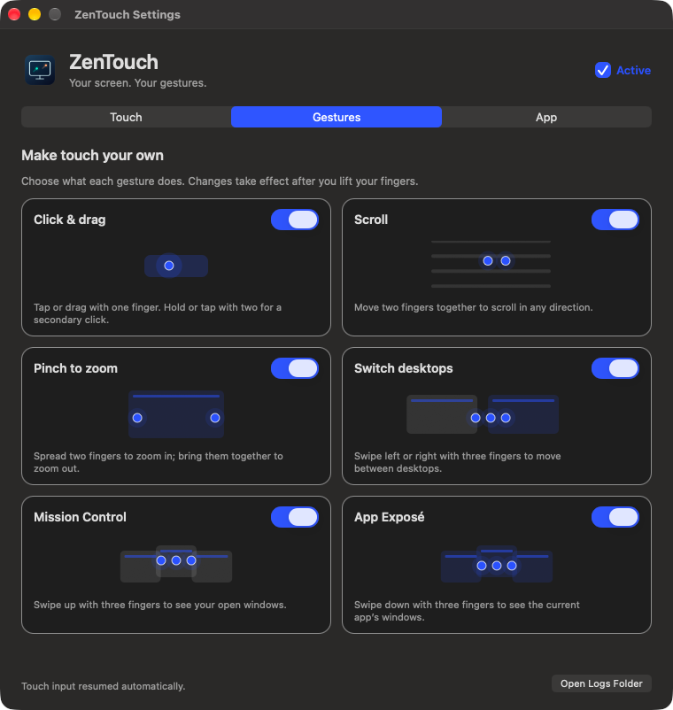
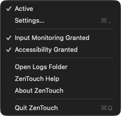
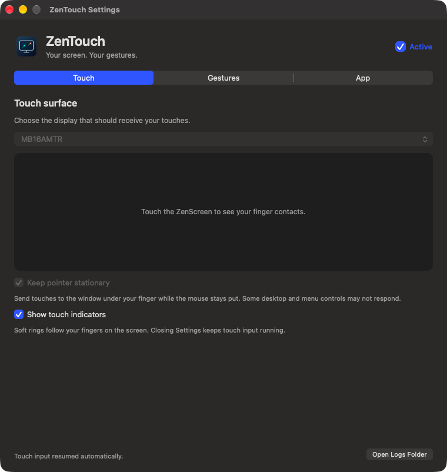
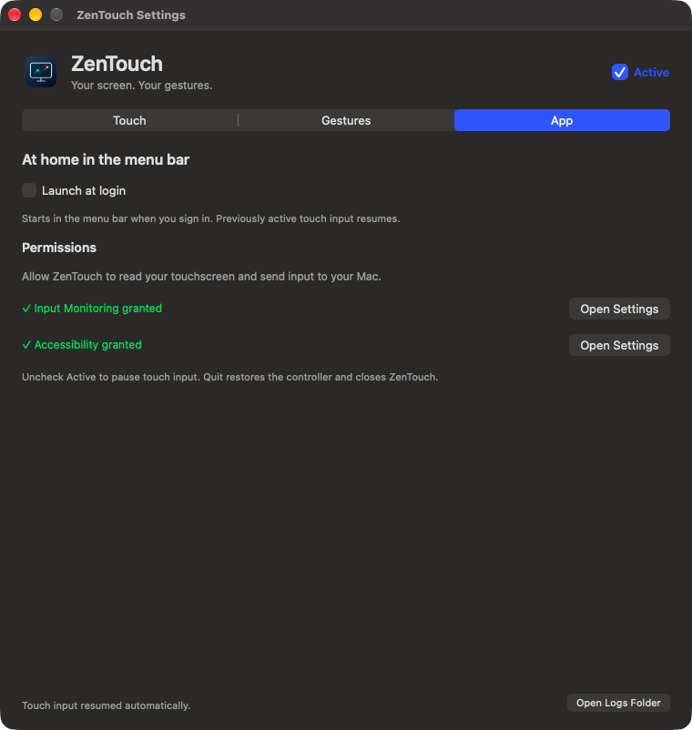

<!--
SPDX-FileCopyrightText: 2026 Alexandru Ciobanu
SPDX-License-Identifier: MIT
-->

ZenTouch lets you use your ASUS touchscreen on a Mac: tap to click, drag with one finger, and scroll with two. It lives in the menu bar, so you can close Settings and get on with using the screen.

## Supported monitors

**ASUS ZenScreen Touch MB16AMTR is tested with ZenTouch on macOS 27.** The other monitors below are potential candidates: ASUS documents ten-point touch for them, but we haven't tested their USB touch controllers with ZenTouch.

| Product (ASUS source) | ZenTouch status |
| --- | --- |
| [ASUS ZenScreen Touch MB16AMTR](https://www.asus.com/displays-desktops/monitors/zenscreen/asus-zenscreen-touch-mb16amtr/) | **Tested and supported** |
| [ASUS ZenScreen Touch MB16AMT](https://www.asus.com/displays-desktops/monitors/zenscreen/zenscreen-touch-mb16amt/) | Potential — untested |
| [ASUS ZenScreen Touch MB16AHT](https://www.asus.com/displays-desktops/monitors/zenscreen/zenscreen-touch-mb16aht/) | Potential — untested |
| [ASUS ZenScreen Ink MB14AHD](https://www.asus.com/displays-desktops/monitors/zenscreen/zenscreen-ink-mb14ahd/) | Potential — untested |
| [ASUS ProArt Display PA148CTV](https://www.asus.com/displays-desktops/monitors/proart/proart-display-pa148ctv/) | Potential — untested |
| [ASUS ProArt Display PA147CDV Creative Tool](https://www.asus.com/us/displays-desktops/monitors/proart/proart-display-pa147cdv/) | Potential — untested |
| [ASUS ProArt Display PA169CDV](https://www.asus.com/displays-desktops/monitors/proart/proart-display-pa169cdv/) | Potential — untested |
| [ASUS BE24ECSBT Multi-touch Monitor](https://www.asus.com/displays-desktops/monitors/business/be24ecsbt/) | Potential — untested |
| [ASUS VT229H Touch Monitor](https://www.asus.com/displays-desktops/monitors/touch/vt229h/) | Potential — untested |
| [ASUS VT169HE Touch Monitor](https://www.asus.com/displays-desktops/monitors/touch/vt169he/) | Potential — untested |
| [ASUS VT168HR Touch Monitor](https://www.asus.com/us/displays-desktops/monitors/touch/vt168hr/) | Potential — untested |
| [ASUS VT168H Touch Monitor](https://www.asus.com/support/faq/1047313/) | Potential — untested, discontinued |
| [ASUS VT168N Touch Monitor](https://www.asus.com/support/faq/1047313/) | Potential — untested, discontinued |
| [ASUS VT207N Touch Monitor](https://www.asus.com/uk/displays-desktops/monitors/all-series/vt207n/) | Potential — untested, legacy |
| [ROG Strix XG129C Touchscreen Gaming Monitor](https://rog.asus.com/au/monitors/accessories/rog-strix-xg129c/) | Potential — untested |

Sources rechecked on **9 October 2026**. “Potential” means a candidate for compatibility work, not support in the current app. Only the MB16AMTR is enabled today; other models may need a new controller profile before they can work. A similar model name doesn't mean the same touch controller. See the [compatibility notes](docs/supported-models.md) to help test another model.

You need **macOS 14 or later** and a USB connection that carries data as well as the screen's video connection. The downloadable preview is for **Apple silicon Macs**. Keep the touchscreen at **0° rotation**; rotated displays aren't supported yet.

## Install

Download the DMG from [Releases](https://github.com/pavkam/zentouch/releases), open it, and drag ZenTouch into Applications. Use that installed copy when granting permissions and updating the app.

These are preview builds, signed with the maintainer's local certificate rather than notarized by Apple. If macOS blocks the app, you can allow it through **System Settings → Privacy & Security → Open Anyway**.

Every successful CI run on **main** publishes a new version with an Apple silicon DMG, ZIP and SHA-256 checksums. Release notes list the merged changes. Re-running the same CI run keeps the same version.

## First run

1. Connect your ZenScreen's **USB data cable**. A video-only connection won't send touches to the Mac.
2. Open ZenTouch. Click its menu bar icon and choose **Settings…**.
3. Open the **App** section and use the permission buttons to allow **Input Monitoring** and **Accessibility** in System Settings. These let ZenTouch read the touchscreen and send clicks and gestures. Quit and reopen the app if macOS asks you to. Green checks show when the permissions are ready.
4. In **Touch**, select your ZenScreen and enable **Active**.

Touch the screen. You'll see your fingers in the Settings preview, and taps should click where you touch. By default, ZenTouch moves the mouse pointer to your touch position.

## Gestures

| Use your fingers to… | What happens |
| --- | --- |
| Tap with one finger | Click |
| Move one finger while touching | Drag |
| Move two fingers together | Scroll up, down, left or right |
| Tap with two fingers | Right-click |
| Hold one finger still, then lift | Right-click |
| Swipe up with three fingers, then lift | Open Mission Control |
| Swipe down with three fingers, then lift | Open App Exposé; still needs live testing |
| Swipe left or right with three fingers | Switch desktops or full-screen apps; still needs live testing |
| Spread or pinch two fingers | Zoom in or out in apps that support pinch |

Open **Settings → Gestures** to choose what your fingers do. Each card has an animated example and its own switch:

- **Click & drag** includes one-finger taps and drags, a two-finger tap, and holding one finger for a right-click.
- **Scroll** controls two-finger scrolling in any direction.
- **Pinch to zoom** controls two-finger zoom.
- **Switch desktops**, **Mission Control** and **App Exposé** control each three-finger action separately.

You can change these while touch input is running. An active gesture ends safely; lift all your fingers before trying the new setting. Your choices survive quitting and reconnecting. All gestures start enabled on a fresh install; updates keep your earlier pinch and three-finger opt-outs. These switches don't change your Mac's trackpad settings.

For three-finger swipes, place three fingers on the screen, move them together, then lift. Up and down trigger their action on lift; the view doesn't follow your fingers as it does on a trackpad. Three-finger dragging isn't supported.

Pinch sends native magnification events. It works with both pointer modes, but the receiving app must support pinch zoom. If nothing happens, check that **Pinch to zoom** is on and try Preview or another zoomable view. Moving both fingers together scrolls; moving them apart or together zooms.

The previews animate only while the Gestures section is visible. macOS **Reduce Motion** shows still illustrations.

## Keep the mouse pointer where it is

Stop touch input, enable **Keep pointer stationary** in **Settings → Touch**, then start again. Taps, dragging and scrolling go to the window under your finger while your mouse pointer stays where you left it. Your choice is saved and used after reconnects.

This mode is still experimental. Native AppKit controls have passed a separate-process test, and tapping and scrolling have been confirmed in live use on macOS 27. Compatibility still varies by app and control. Desktop, menu bar and some menu controls may not respond. If a window closes during a drag, ZenTouch drops the remaining events rather than sending them to another app. It never switches back to moving the pointer on its own. Turn the option off to restore normal pointer behavior.

## Everyday use

The menu's **Active** checkmark is your on/off switch. Settings has the same **Active** checkbox. Closing Settings keeps touch working; **Quit ZenTouch** stops it and exits.

If the screen sleeps or disconnects, ZenTouch waits for it to return. **Active** stays checked while waiting, so input can resume without restarting the app. A slashed menu bar icon means the selected screen or its USB touch connection is missing. Open Settings or hover over the icon to see what's missing. Touch controls become available when the hardware returns. You can always stop input to cancel automatic resuming.

Want to see where your fingers are? Turn on **Show touch indicators** in **Settings → Touch**. Teal rings follow each touch on the screen, including with Settings closed. You can toggle them while input is running. They're off by default; macOS Reduce Motion makes them steady instead of pulsing.

## Launch when you sign in

Enable **Launch at login** in **Settings → App** to start ZenTouch in the menu bar at your next login. Touch input resumes if it was active when you last used the app; a disconnected monitor is handled when it returns.

If the checkbox shows a dash, macOS is waiting for approval. Click **Open Login Items** to approve ZenTouch in System Settings. You can also disable it there—the checkbox follows the system setting. This option works without a monitor attached.

## Settings at a glance

**Touch** chooses your screen, shows live finger contacts and controls pointer behavior and touch indicators. **Gestures** has the six individual switches. **App** handles launch at login and permissions. The window stays the same size, so every gesture card is visible without scrolling.

See the Touch and App tabs

All four captures are in [the media gallery](docs/media/README.md).

## If something doesn't work

| What you see | What to try |
| --- | --- |
| No fingers in the Settings preview | Check the USB data cable, Input Monitoring permission, and that touch input is running. |
| Fingers appear, but nothing clicks | Check Accessibility permission and the selected display. |
| ZenTouch isn't listed in Privacy & Security | Use **+** to add the installed ZenTouch app, then enable it. |
| Active is disabled or the icon is slashed | Make sure the selected screen is awake and its USB data cable is connected. Settings explains which connection is missing. |
| The pointer doesn't line up with your finger | Stop input, select the correct display, and check that its rotation is 0°. |
| A control ignores stationary-pointer touch | Stop input, turn off **Keep pointer stationary** and start again. Include the app and control in a bug report. |
| Touch stops after a forced quit | Reconnect the USB cable. A normal Stop or Quit lets ZenTouch restore the controller's previous mode. |

Still stuck? Choose **Open Logs Folder** and [open an issue](https://github.com/pavkam/zentouch/issues). Include your monitor model, macOS version and what you tried. Logs live in `~/Library/Logs/ZenTouch`; they rotate automatically and use at most 24 MiB. They include touch positions and actions from the touchscreen, so review any excerpt before sharing it.

## What works, and what still needs testing

Clicks, two-finger scrolling, three-finger Mission Control, use with Settings closed, and touch recovery after a monitor power cycle have been tested on an MB16AMTR with macOS 27. Desktop switching and App Exposé still need live testing. Pinch delivery has passed a separate-process native AppKit test for zoom in, zoom out and cancellation with the pointer stationary; physical pinch and independent switches are confirmed in live use. Wider app compatibility remains under test. The latest attach/detach icon and control changes have automated coverage; physical testing is pending.

ZenTouch translates touches into mouse and scroll events. It doesn't turn the screen into an Apple trackpad or add direct-touch support to Mac apps. Stationary-pointer routing, three-finger gestures and pinch rely on undocumented macOS behavior, which can change with OS updates. See the [quality notes](docs/quality-pass.md) for the detailed test record.

## Build or contribute

The [developer guide](docs/development.md) covers building, signing, packaging and diagnostics. Start with [CONTRIBUTING.md](CONTRIBUTING.md) if you'd like to help, especially with another monitor model. There are no external runtime dependencies.

Questions go in [Discussions](https://github.com/pavkam/zentouch/discussions); bugs go in [Issues](https://github.com/pavkam/zentouch/issues). Report security problems through [private reporting](SECURITY.md).

ZenTouch is an independent project, unaffiliated with ASUS or Apple. Its code and artwork use the [MIT License](LICENSE), with [upstream notices](THIRD-PARTY-NOTICES.md) for the gesture adapters.
