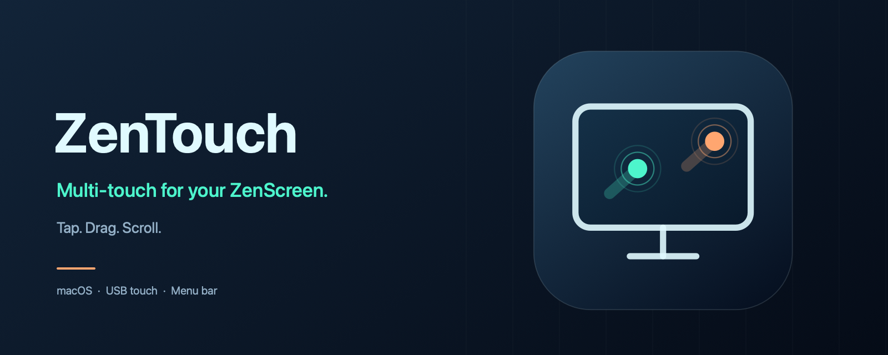
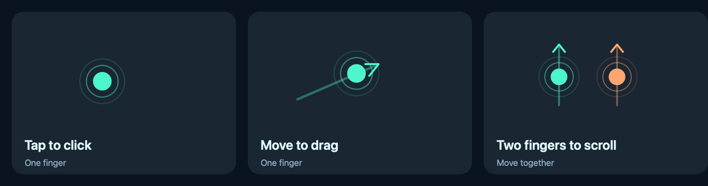

<!--
SPDX-FileCopyrightText: 2026 Alexandru Ciobanu
SPDX-License-Identifier: MIT
-->



[](https://github.com/pavkam/zentouch/actions/workflows/ci.yml)
[](LICENSE)


ZenTouch brings taps, dragging, right-clicks, two-finger scrolling and three-finger swipes to the **ASUS ZenScreen Touch MB16AMTR** on macOS. It runs in the menu bar. Close Settings and carry on using the screen.

The tested controller is **eGalaxTouch EXC3200-2505**, USB **0eef:c000**. ZenTouch verifies its exact HID descriptor before translating input. Clicks, scrolling and operation with Settings closed have been confirmed on the attached Mac running macOS 27. Other controllers need their own verified profile.

## Install

Download an **arm64 preview** from [Releases](https://github.com/pavkam/zentouch/releases), open the DMG and drag ZenTouch into Applications. Keep one installed copy and use that same path when granting permissions.

The release includes a ZIP and SHA-256 manifest too. With both archives and the manifest downloaded into the same folder, verify them with `shasum -a 256 -c ZenTouch-0.4.0-arm64.sha256`.

Preview binaries are signed with the maintainer's stable local certificate. They are **not Developer ID notarized**; macOS may block opening them. Use Privacy & Security → **Open Anyway** if you choose to run the preview, or build from source with your own signing identity. Never install the disposable packages from CI artifacts over a working app.

### Build from source

Install [Apple Command Line Tools](https://developer.apple.com/xcode/resources/) or Xcode, with Swift 6 or newer:

```sh
git clone https://github.com/pavkam/zentouch.git
cd zentouch
make check
make install
open ~/Applications/ZenTouch.app
```

Signing requires an existing code-signing identity. If you have none, open **Keychain Access → Certificate Assistant → Create a Certificate**, create a self-signed **Code Signing** certificate, and configure its Code Signing trust for local use. Check available identities with `security find-identity -v -p codesigning`.

If several identities are available, select one on the first build:

```sh
ZENTOUCH_SIGNING_IDENTITY="Your signing identity" make install
```

The build pins its public fingerprint locally and reuses that key. Updates refuse a different identity, preserving the signing requirement used by macOS privacy grants. The installer cleanly quits the old app before replacing it at `~/Applications/ZenTouch.app`.

## Start using the screen

1. Connect the ZenScreen's **USB data connection**. Video alone does not carry touch input.
2. Open ZenTouch, then choose **Settings…** from its menu bar icon.
3. Allow **Input Monitoring** and **Accessibility** in macOS Settings. Quit and reopen ZenTouch if macOS requests it. The green checks show the grants seen by the running app.
4. Select the ZenScreen, set display rotation to **0°**, and click **Enable Touch Input**.

The menu's checked **Active** item means input is running. Click it to stop or resume input. **Quit ZenTouch** stops input and exits; closing Settings keeps it running.



| Gesture | Result |
| --- | --- |
| One-finger tap | Click |
| Move one finger | Drag |
| Move two fingers together | Scroll vertically or horizontally |
| Two-finger tap | Right-click |
| Hold one finger still, then lift | Right-click |
| Three-finger swipe left/right | Switch desktops or full-screen apps |
| Three-finger swipe up | Mission Control |
| Three-finger swipe down | App Exposé |
| Pinch | Experimental, opt-in; app compatibility remains unverified |

**Three-finger swipes** are enabled by default. Place three fingers, move them together, then lift. To disable them, stop input, uncheck **Enable three-finger swipes** in Settings, and resume. This is separate from macOS’s built-in trackpad settings; it does not implement three-finger dragging.

ZenTouch remembers the selected display and whether input was enabled. Sleep or locking pauses it; wake resumes it when the display and permissions are available. USB disconnects, permission loss and display changes stop input. Check Settings and enable it again.

## If something doesn't work

- **No finger contacts:** check the USB data cable and Input Monitoring. Choose **Test Finger Contacts…** to preview contacts without sending clicks. Click that menu item again, or Stop in Settings, to end the test.
- **Contacts appear but input doesn't:** check Accessibility and the selected display. The permission checks refresh while the app runs.
- **App missing from Privacy & Security:** use **+** to add the installed ZenTouch app. Keep the same signing identity and installation path for updates.
- **Pointer alignment changed:** stop input, select the correct screen and keep rotation at 0°. Display reconfiguration intentionally stops the current session.
- **Controller left in a strange state after a forced kill:** reconnect its USB cable. Normal Stop/Quit requests the previous controller mode.

**Open Logs Folder** opens `~/Library/Logs/ZenTouch`. Logs include controller reports, decoded contacts, translated actions, permission changes and cleanup. Rotation retains three files of up to 8 MiB each (**24 MiB** total). Other input devices are not recorded. Review excerpts before sharing them publicly.

## Scope

ZenTouch translates touch reports into public macOS mouse and scroll events. It does not currently provide complete Apple trackpad behavior or produce native AppKit direct-touch events. Three-finger swipes send native, phased Dock gestures through an isolated private adapter, including the raw HID payload required on macOS 27. This behavior can change with macOS updates. Pinch also uses undocumented fields. Three-finger swipes still need live confirmation; automated checks verify recognition, cancellation and event encoding. Six-to-ten-contact continuation is covered synthetically and still needs live verification.

This is an independent project, unaffiliated with ASUS or Apple.

## Development

```sh
make check      # Formatting, license/repository checks, builds and 44 behavior checks
make format     # Apply Swift formatting
make artwork    # Regenerate committed README/icon graphics
make build      # Build and verify the signed app and diagnostic helper
make package    # Verified DMG, ZIP and SHA-256 checksums
```

There are no external runtime dependencies. CI checks macOS 15 and 26, then verifies signed archive relocation with a disposable identity. It cannot replace live hardware testing.

See [development and diagnostics](docs/development.md), [the protocol investigation](docs/feasibility.md), [the quality pass](docs/quality-pass.md), [the changelog](CHANGELOG.md) and [contribution guidelines](CONTRIBUTING.md). Questions go in [Discussions](https://github.com/pavkam/zentouch/discussions); bugs go in [Issues](https://github.com/pavkam/zentouch/issues). Security reports use [private reporting](SECURITY.md).

ZenTouch's code and artwork use the [MIT License](LICENSE). The gesture adapters retain their [upstream MIT and ISC notices](THIRD-PARTY-NOTICES.md).
